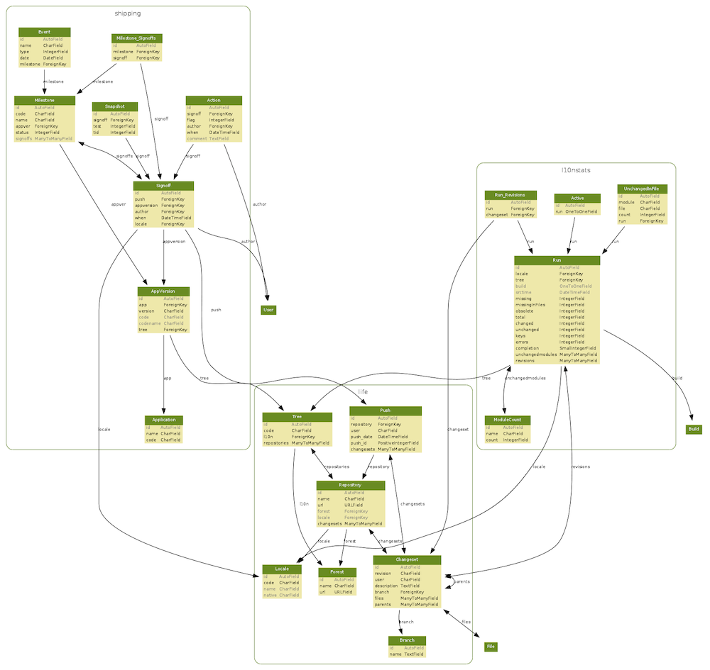

.. index:: overview

.. _overview-chapter:

Overview
========

(image originally from http://people.mozilla.org/~axel/all.svg)

As you can see in this database diagram, Elmo consists of 3 major parts:

* :ref:`life-chapter`
* :ref:`shipping-chapter`
* :ref:`l10nstats-chapter`

Their names imply what they each do and deal with. There are other
various tools that aren't directly part of these major apps but are
also important. For example, the privacy app (TODO: figure out whether
to bother documenting this).

Basically the whole database model is based around the structure that
is used in Mozilla to develop Firefox, Thunderbird, etc. but instead
of source code to the running programs, it's definition files
containing translatable strings. An example of a translatable string
file can for example look like this::

 <!-- Tab context menu -->
 <!ENTITY  reloadTab.label                    "Oppdater fane">
 <!ENTITY  reloadTab.accesskey                "O">
 <!ENTITY  reloadAllTabs.label                "Oppdater alle fanene">
 <!ENTITY  reloadAllTabs.accesskey            "d">
 <!ENTITY  closeOtherTabs.label               "Lat att andre faner">
 <!ENTITY  closeOtherTabs.accesskey           "a">

(this is the `Norwegian (nn-NO) source for browser.dtd
<http://hg.mozilla.org/l10n-central/nn-NO/file/d2b41af23354/browser/chrome/browser/browser.dtd>`_)
